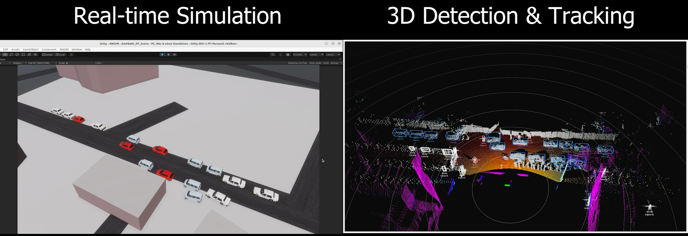
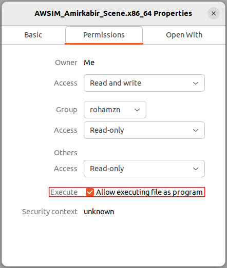
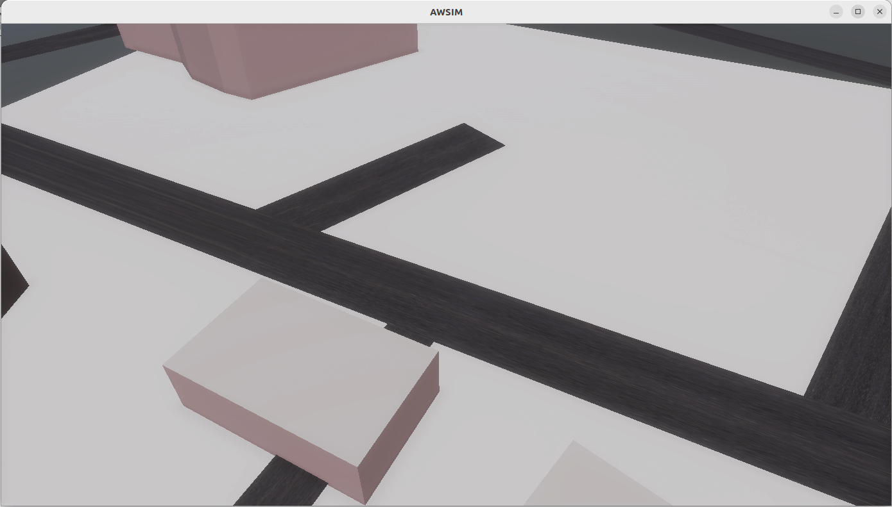
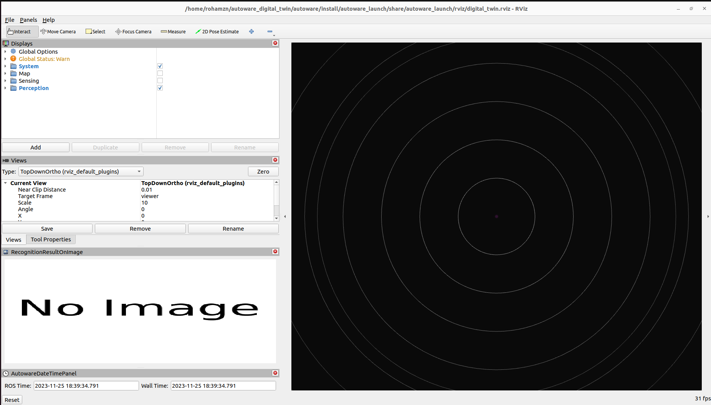
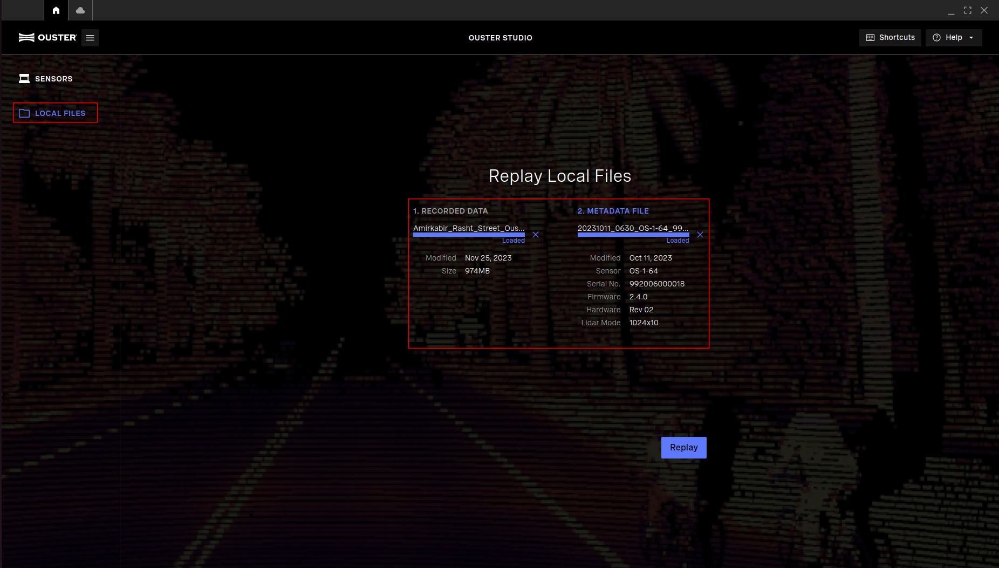
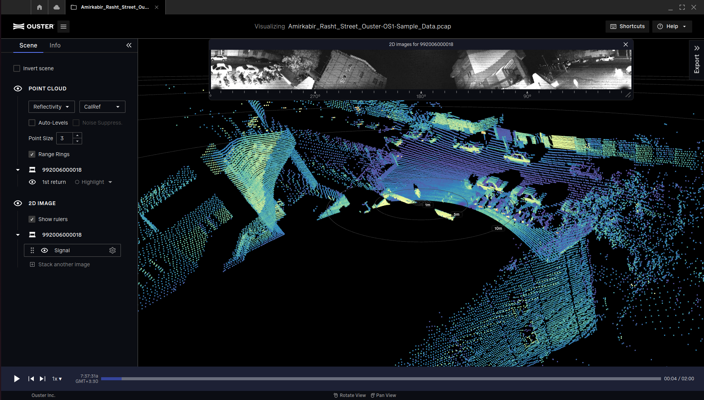
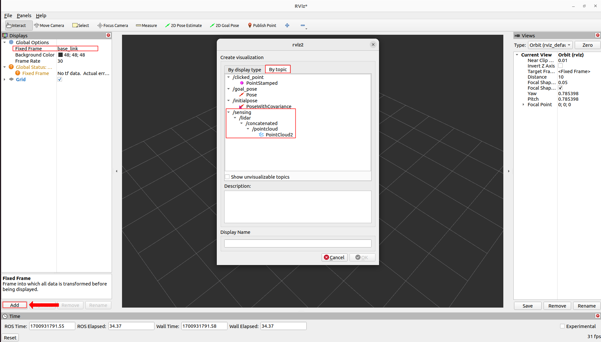
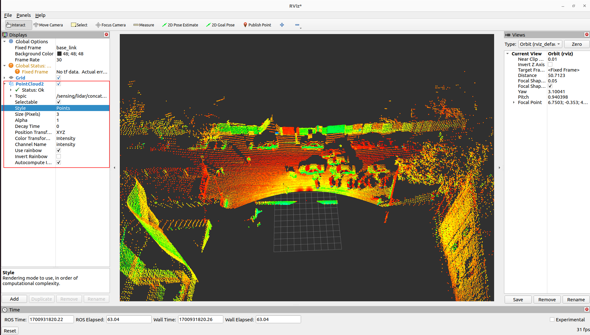
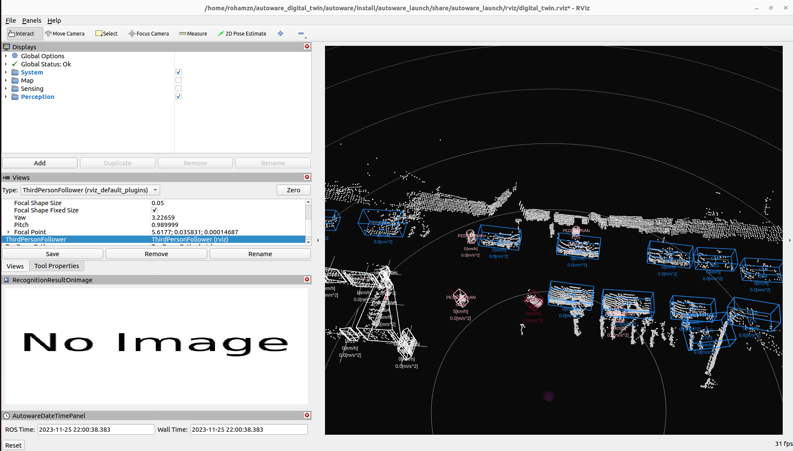
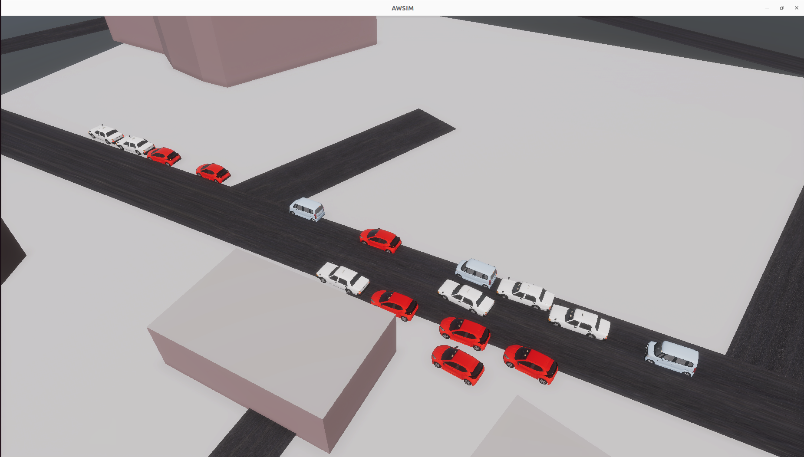

# Quick Start Demo

Below you can find instructions on how to setup the semi-automatic demo of AUT-DT simulation made possible with Autoware and AWSIM.
The instruction assumes using the Ubuntu OS.



### Demo configuration

The simulation provided in the AUT-DT demo is configured as follows:

|AUT-DT Demo Settings||
|:--|:--|
|Environment|Amirkabir University of Technology, Rasht Street|
|Sensors|OS1:64 LiDAR * 1|
|3D Detection Model|TensorRT Centerpoint fp32|
|Data Association Solver|muSSP|
|Main Tracker|EKF|
|ROS2|humble|
|Autoware|digital_twin branch|

### PC specs

Please make sure that your machine meets the following requirements in order to run the simulation correctly:

|Required PC Specs||
|:--|:--|
|OS|Ubuntu 22.04|
|CPU|6cores and 12thread or higher|
|GPU|RTX 20 Series or higher|
|Nvidia Driver (Windows)|>=472.50|
|Nvidia Driver (Ubuntu 22)|>=515.43.04|


### Localhost settings

The simulation is based on the appropriate network setting, which allows for trouble-free communication of the AWSIM simulation with the Autoware software.
To apply required localhost settings please add the following lines to `~/.bashrc` file.

``` bash
export ROS_LOCALHOST_ONLY=1
export RMW_IMPLEMENTATION=rmw_cyclonedds_cpp

if [ ! -e /tmp/cycloneDDS_configured ]; then
	sudo sysctl -w net.core.rmem_max=2147483647
	sudo ip link set lo multicast on
	touch /tmp/cycloneDDS_configured
fi
```

## Start the demo

### Running the AUT-DT simulation demo

To run the simulator, please follow the steps below.

1. Install Nvidia GPU driver (Skip if already installed).
    1. Add Nvidia driver to apt repository
    ```
    sudo add-apt-repository ppa:graphics-drivers/ppa
    sudo apt update
    ```
    2. Install the recommended version of the driver.
    ```
    sudo ubuntu-drivers autoinstall
    ```
    3. Reboot your machine to make the installed driver detected by the system.
    ```
    sudo reboot
    ```
    4. Open terminal and check if `nvidia-smi` command is available and outputs summary similar to the one presented below.
    ```
    $ nvidia-smi 
    Sat Nov 25 14:47:51 2023       
    +-----------------------------------------------------------------------------+
    | NVIDIA-SMI 545.23.08    Driver Version: 545.23.08    CUDA Version: 12.3     |
    |-------------------------------+----------------------+----------------------+
    | GPU  Name        Persistence-M| Bus-Id        Disp.A | Volatile Uncorr. ECC |
    | Fan  Temp  Perf  Pwr:Usage/Cap|         Memory-Usage | GPU-Util  Compute M. |
    |                               |                      |               MIG M. |
    |===============================+======================+======================|
    |   0  NVIDIA GeForce ...   On  | 00000000:01:00.0 Off |                  N/A |
    | N/A%   34C    P0  751W / 115W |   11MiB / 16384MiB   |      0%      Default |
    |                               |                      |                  N/A |
    +-------------------------------+----------------------+----------------------+

    +-----------------------------------------------------------------------------+
    | Processes:                                                                  |
    |  GPU   GI   CI        PID   Type   Process name                  GPU Memory |
    |        ID   ID                                                   Usage      |
    |=============================================================================|
    |    0   N/A  N/A      2873      G   /usr/lib/xorg/Xorg                 4MiB  |
    +-----------------------------------------------------------------------------+
    ```

2. Install Vulkan Graphics Library (Skip if already installed).
    1. Update the environment.
    ```
    sudo apt update
    ```
    2. Install the library.
    ```
    sudo apt install libvulkan1
    ```

3. Download and Run AWSIM Amirkabir Scene binary.

    1. Download `AUT-DT_v1.0.0.zip`.

        [Download AWSIM Amirkabir Scene for ubuntu](https://github.com/rzninvo/Digital-Twin-of-a-Traffic-Scene-Using-RSU-and-AWSIM/releases/download/v1.0.0/AUT-DT_v1.0.0.zip){.md-button .md-button--primary}
    
    2. Unzip the downloaded file.

    3. Make the `AWSIM_Amirkabir_Scene.x86_64` file executable.

        Rightclick the `AWSIM_Amirkabir_Scene.x86_64` file and check the `Execute` checkbox

        

        or execute the command below.

        ```
        chmod +x <path to AUT-DT folder>/AWSIM_Amirkabir_Scene.x86_64
        ```

    4. Launch `AWSIM_Amirkabir_Scene.x86_64`.
        ```
        ./<path to AUT-DT folder>/AWSIM_Amirkabir_Scene.x86_64
        ``` 
        
        !!! warning
        
            It may take some time for the application to start the so please wait until image similar to the one presented below is visible in your application window.

        

### Launching Autoware

In order to configure and run the Autoware software with the AWSIM Simulator, please:

1. Clone [Autoware](https://github.com/rzninvo/autoware.git) and move to the directory.
```
git clone https://github.com/rzninvo/autoware.git
cd autoware
```
1. Switch branche to `digital_twin`. *NOTE: The latest `main` branch is for [ROS 2 humble](https://docs.ros.org/en/rolling/Releases/Release-Humble-Hawksbill.html).*
```
git checkout digital_twin
```
1. Configure the environment. (Skip if Autoware environment has been configured before)
```
./setup-dev-env.sh
```
1. Create the `src` directory and clone external dependent repositories into it.
```
mkdir src
vcs import src < autoware.repos
```
1. Install dependent ROS packages.
```

source /opt/ros/humble/setup.bash
rosdep update
rosdep install -y --from-paths src --ignore-src --rosdistro $ROS_DISTRO
```
7. Build the workspace.
```
colcon build --symlink-install --cmake-args -DCMAKE_BUILD_TYPE=Release -DCMAKE_CXX_FLAGS="-w"
```
8. Launch Autoware.
```
source install/setup.bash
ros2 launch autoware_launch digital_twin.launch.xml
```
    (Optional Launch) For when you have a `.pcd` map file:
```
source install/setup.bash
ros2 launch autoware_launch digital_twin.launch.xml map_path:=<your mapfile location>
```   

    !!! warning

        `<your mapfile location>` must be changed arbitrarily. When specifying the path the `~` operator cannot be used - please specify absolute full path.


### Downloading Sample Data Recording

   1. Download `Amirkabir_Rasht-Street_Sample_Data_Recording.zip`.

    [Download Amirkabir Rasht Street Sample Data](https://github.com/rzninvo/Digital-Twin-of-a-Traffic-Scene-Using-RSU-and-AWSIM/releases/download/v1.0.0/Amirkabir_Rasht-Street_Sample_Data_Recording.zip){.md-button .md-button--primary}
    
   2. Unzip the downloaded file.
   3. (Optional) Make sure the downloaded recordings are not corrupt.
      1. Download `Ouster-Studio` from [Ouster Website](https://ouster.com/products/software/ouster-studio). 
      2. Run the Ouster-Studio AppImage and play the downloaded recording:
        
      3. You should be able to see the recording.
        

### Launching AUT-DT's Specific Sample Data Publisher

The recorded sample data of Amirkabir Rasht Street **is not calibrated** and won't work well with Autoware's perception module. In order to publish it correctly, follow these steps:

1. Clone [Digital-Twin-of-a-Traffic-Scene](https://github.com/rzninvo/Digital-Twin-of-a-Traffic-Scene-Using-RSU-and-AWSIM) and move to the directory.
```
git clone https://github.com/rzninvo/Digital-Twin-of-a-Traffic-Scene-Using-RSU-and-AWSIM
cd Digital-Twin-of-a-Traffic-Scene-Using-RSU-and-AWSIM
```
1. Build the workspace.
```
colcon build --symlink-install --cmake-args -DCMAKE_BUILD_TYPE=Release -DCMAKE_CXX_FLAGS="-w"
```
1. Launch the publisher.
```
source install/setup.bash
ros2 launch pcap_to_pointcloud2_publisher_py pcap_to_ros_launch.xml pcap_file_path:=<path to Amirkabir_Rasht_Street_Ouster-OS1-Sample_Data.pcap> pcap_metadata_path:=<path to 20231011_0630_OS-1-64_992006000018.json> aut_dt:=true publish_intensity:=false
```

    !!! warning

        `pcap_file_path` and `pcap_metadata_path` must be changed arbitrarily. When specifying the path the `~` operator cannot be used - please specify absolute full path.
    
    !!! info
        **(Optional)** You can change the `publish_intensity` parameter to `true` for better visualization. The `aut_dt` parameter is **only used for Amirkabir Rasht Street Sample Data**, turn it to `false` for other sample data.

1. (Optional) Launch rviz2 in a new terminal.
```
rviz2
```
1. (Optional) Set the `Fixed Frame` to `base_link`. Add the published `PointCloud2` topic by clicking on the `Add` button and finding the topic.

1. (Optional) Set the `Style` to `Points` and you should be able to see the published calibrated sample data on the `/sensing/lidar/concatenated/pointcloud` topic.


    !!! info
        If your published PointCloud2 is **all white**, it's because of the `publish_intensity` launch file parameter being **false**.

## Let's run the AUT-DT simulation
   1. Before launching AWSIM and Autoware, open two seperate terminals and write these two commands:
      1. Run the **static transform publisher** for the `map` and `viewer` (rviz2 viewer frame):
        ```
        ros2 run tf2_ros static_transform_publisher 0 0 0 0 0 0 map viewer
        ```
      2. Run the **static transform publisher** for the `map` and `base_link` (lidar coordinate frame):
        ```
        ros2 run tf2_ros static_transform_publisher 0 0 0 0 0 0 map base_link
        ```
        
        !!! warning
            The AUT-DT simulation **won't work** without these two commands. Also remember to run these commands **before launching Autoware**.
        !!! info
            For more information on static transform publishers, visit this link:   
            [https://docs.ros.org/en/foxy/Tutorials/Intermediate/Tf2/Writing-A-Tf2-Static-Broadcaster-Py.html](https://docs.ros.org/en/foxy/Tutorials/Intermediate/Tf2/Writing-A-Tf2-Static-Broadcaster-Py.html).   
            You can change the transform vectors based on your **sample data** (if your sample data is not calibrated).   

   2. Launch the AWSIM Amirkabir Scene by [following the previous steps](#running-the-aut-dt-simulation-demo).
   3. Launch the Autoware Digital Twin by [following the previous steps](#launching-autoware).
   4. Launch the Amirkabir Sample Data Publisher by [following the previous steps](#launching-aut-dts-specific-sample-data-publisher)
   5. You should be able to see the real-time detection happening in Autoware's rviz2 panel.
    
    (Optional) You can enable the `Sensing` Module to see the original published PointCloud2.
    
   6. You should be able to see the real-time simulation in the `AWSIM_Amirkabir_Scene.x86_64` runtime.
    

You have successfuly launched the AUT-DT demo!

## 6. Troubleshooting

In case of any problems with running the sample AWSIM binary with Autoware, start with checking our [Troubleshooting page](https://tier4.github.io/AWSIM/DeveloperGuide/TroubleShooting/) with the most common problems.
