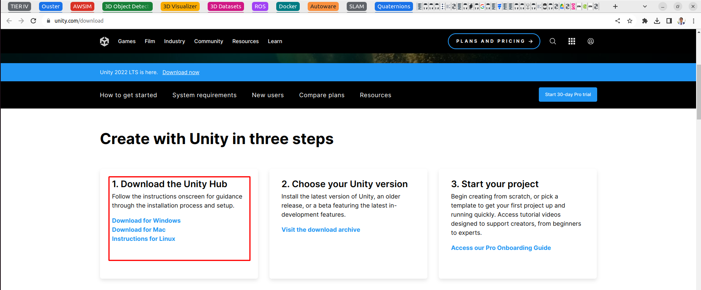
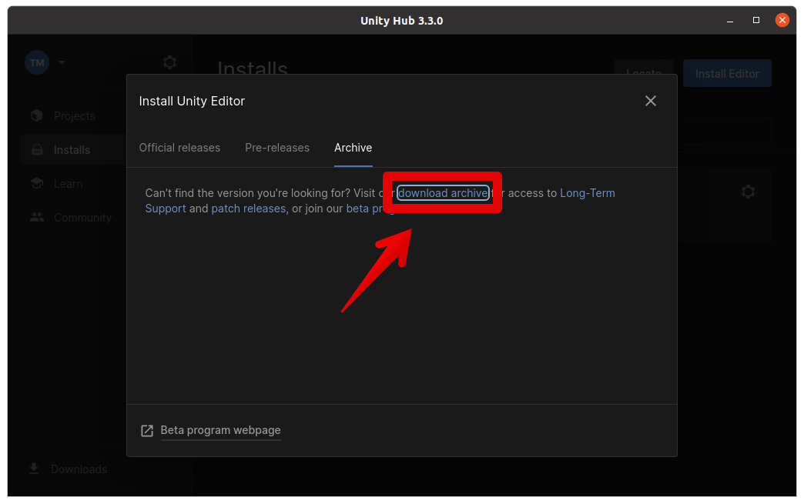
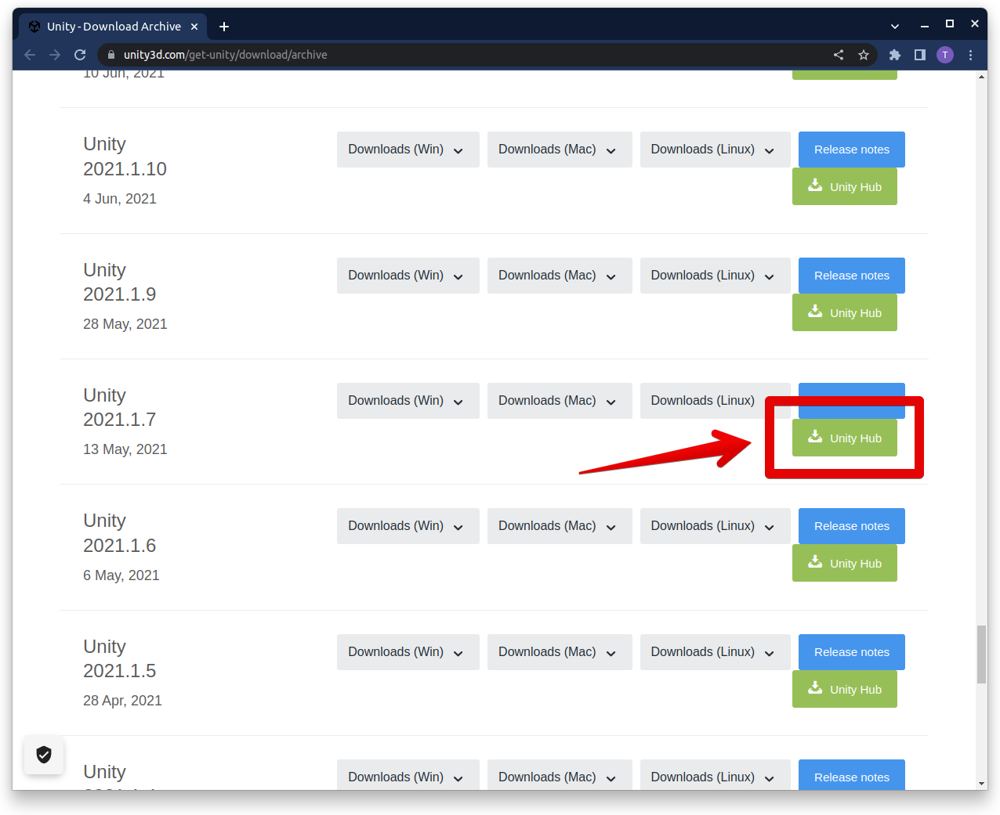
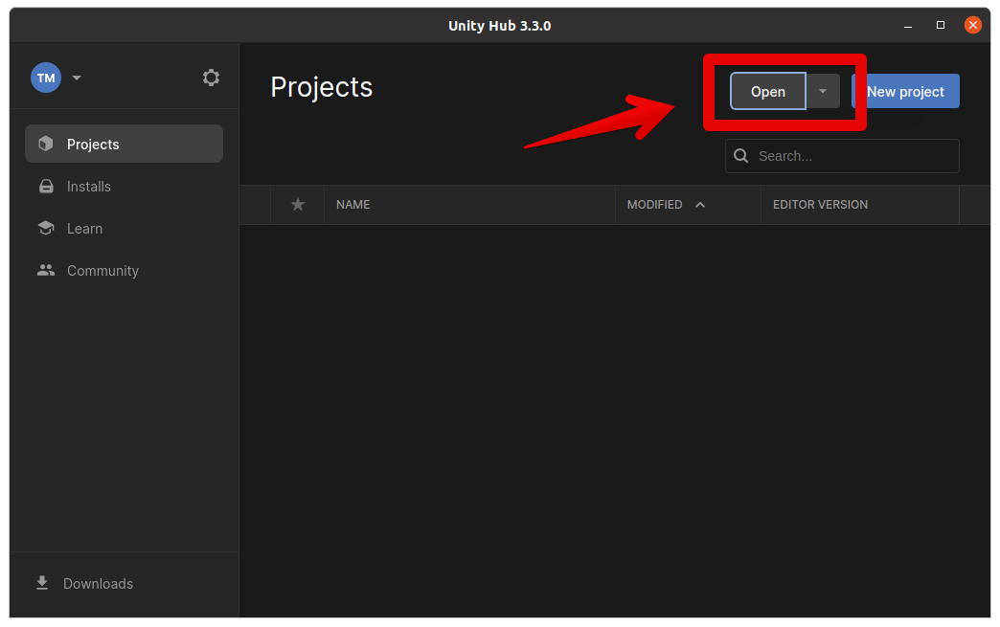
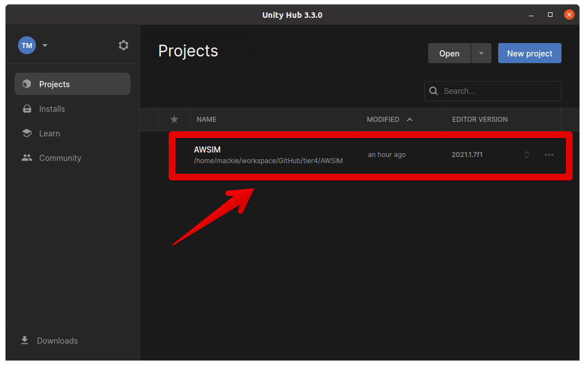
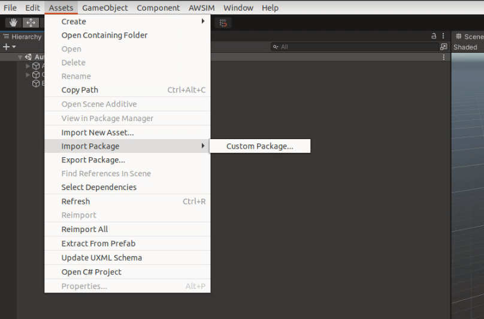
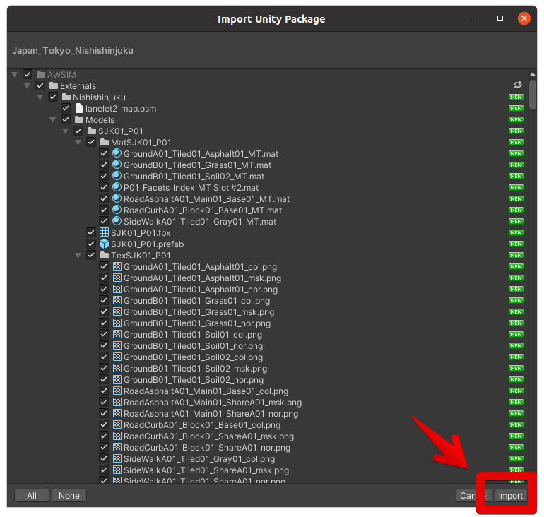
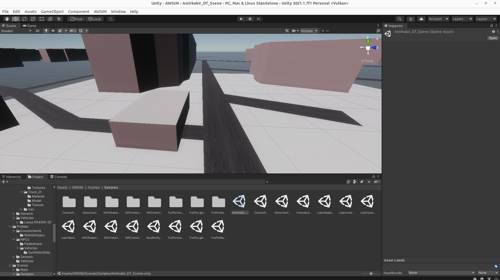

# Setup Unity Project

!!! info

    It is advised to checkout the [Quick Start Demo](../QuickStartDemo) tutorial before reading this section.

This page is a tutorial for setting up a AWSIM Unity project.

## Environment preparation

### System setup

=== "Ubuntu 22"
    1. Make sure your machine meets the [required hardware specifications](../QuickStartDemo/#pc-specs).
        - *NOTE: PC requirements may vary depending on simulation contents which may change as the simulator develops*
    2. Prepare a desktop PC with Ubuntu 22.04 installed.
    2. Install [Nvidia drivers and Vulkan Graphics API](../QuickStartDemo/#running-the-awsim-simulation-demo).
    3. Install [git](https://git-scm.com/).

=== "Windows"
    1. Make sure your machine meets the [required hardware specifications](../QuickStartDemo/#pc-specs).
        - *NOTE: PC requirements may vary depending on simulation contents which may change as the simulator develops*
    2. Prepare a desktop PC with Windows 10 or 11 (64 bit) installed.
    3. Install [git](https://git-scm.com/).

### Unity installation

!!! info

    AWSIM's Unity version is currently **2021.1.7f1**

Follow the steps below to install Unity on your machine:

1. Install UnityHub to manage Unity projects. Please go to [Unity download page](https://unity3d.com/get-unity/download) and download latest `UnityHub.AppImage`.

2. Install Unity 2021.1.7f1 via UnityHub.
    - Open your applications page and locate `unityhub` (or use the searchbar). Attempt to run the app:
        

        !!! info
            You can also type ```$ unityhub``` in your terminal to run `unityhub`.   

    - To install Unity Editor please proceed as shown on the images below



    - At this point, your Unity installation process should have started.
    - After successful installation the version will be available under the `Installs` tab in Unity Hub.


### Open AWSIM project

To open the Unity AWSIM project in Unity Editor:
1. Make sure you have the AWSIM repository cloned
    ```
    git clone https://github.com/rzninvo/AWSIM.git
    ```

2. Launch UnityHub from the terminal.
    ```
    unityhub
    ```

3. Open the project in UnityHub
    - Click the `Open` button


    - Navigate the directory where the AWSIM repository was cloned to


    - The project should be added to `Projects` tab in Unity Hub. To launch the project in Unity Editor simply click the `AWSIM` item


    - The project is now ready to use


!!! warning

    If you get the safe mode dialog when starting UnityEditor, you may need to install openssl.

    1. download libssl  
    `$ wget http://security.ubuntu.com/ubuntu/pool/main/o/openssl1.0/libssl1.0.0_1.0.2n-1ubuntu5.13_amd64.deb`
    2. install  
    `sudo dpkg -i libssl1.0.0_1.0.2n-1ubuntu5.11_amd64.deb`

### Import external packages

To properly run and use AWSIM project in Unity it is required to download map package which is not included in the repository.

1. Download and import `Japan_Tokyo_Nishishinjuku.unitypackage`

    [Download Map files (unitypackage)](https://github.com/tier4/AWSIM/releases/download/v1.1.0/Japan_Tokyo_Nishishinjuku.unitypackage){.md-button .md-button--primary}

2. In Unity Editor, from the menu bar at the top, select `Assets -> Import Package -> Custom Package...` and navigate the `Japan_Tokyo_Nishishinjuku.unitypackage` file.


3. `Nishishinjuku` package has been successfully imported under `Assets/AWSIM/Externals/`directory.


!!! info

    The Externals directory is added to the `.gitignore` because the map has a large file size and should not be directly uploaded to the repository.

## Run the demo in Editor

The following steps describe how to run the demo in Unity Editor:

1. Open the `Amirkabir_DT_Scene.unity` scene placed under `Assets/AWSIM/Scenes/Samples` directory
2. Run the simulation by clicking `Play` button placed at the top section of Editor.


    !!! warning
        If you open `unityhub` from the applications menu, you might not be able to see the simulated vehicles. In this case, run unityhub from the **terminal**.
<br><br><br><br>
