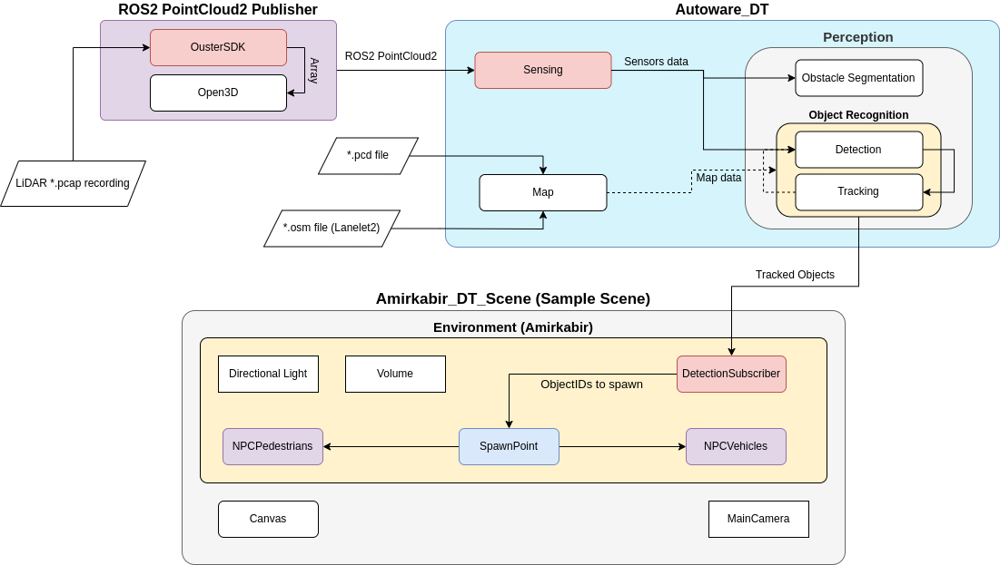
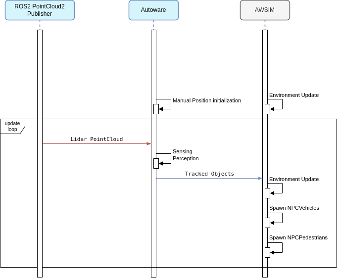

<video width="1920" controls autoplay muted loop>
<source src="awsim_video.mp4" type="video/mp4">
</video>

[*Autoware*](../Autoware/) is a robust open-source software suite designed for autonomous driving. Featuring a modular design that includes perception, localization, planning, and control modules, it offers a comprehensive solution for developing self-driving vehicles. When integrated with the [*AWSIM*](../AWSIM/) simulator, *Autoware* enables safe testing, validation, and refinement of autonomous driving algorithms across a variety of scenarios. This combination can also be used for the simulation of real-world traffic conditions, thereby increasing the realism of the simulated environment and improving validation accuracy for autonomous vehicle testing.

!!! note "Run with Autoware"
    If you would like to know how to run *AWSIM* with *Autoware*, we encourage you to read this [section](../../GettingStarted/QuickStartDemo/).

## Features
The combination of *Autoware* and *AWSIM* provides the opportunity to check the correctness of the vehicle's behavior in various traffic situations. [Here](https://tier4.github.io/AWSIM/Introduction/CombinationWithAutoware/#features) are presented some typical features provided by this combination. Moreover, examples of detecting several bad behaviors are included. Below are some extended features for the *Digital Twin* branch.
### *.pcap Recording to PointCloud2 Publisher
All *.pcap LiDAR recordings can be converted to [ROS2 PointCloud2 messages](https://docs.ros.org/en/melodic/api/sensor_msgs/html/msg/PointCloud2.html).   
<video width="1920" controls autoplay muted loop>
<source src="./features/PointCloud_Conversion.mp4" type="video/mp4">
</video>

### Real-Time Object Detection and Tracking using Autoware
<video width="1920" controls autoplay muted loop>
<source src="../Autoware_DT/3D_Detection_Tracking.mp4" type="video/mp4">
</video>

### Traffic Simulation in AWSIM
<video width="1920" controls autoplay muted loop>
<source src="./features/Real-time_Simulation.mp4" type="video/mp4">
</video>

## Combination Architecture

The combination of *AWSIM* with *Autoware* in *AUT_DT* is possible thanks to the *Perception* module of [*Autoware*](../Autoware/) architecture. The component responsible for ensuring connection with these modules from the *AWSIM* side is `DetectionSubscriber`. It has been adapted to the *Autoware* architecture and provides *ROS2* topic-based communication. However, the other essential component is the `ROS2 PointCloud2 Publisher`, which provides ROS2-based PointCloud data to *Autoware*.

The `ROS2 PointCloud2 Publisher` component provides the publication of the current LiDAR frame through a script written by Python. It provides real-time information such as: current frame timestamp, current frame pointcloud data.

On the other hand, the `Sensing` component is responsible for subscribing to the ROS2 Pointcloud2 topic from *Autoware*. It subscribes to the current stream of LiDAR data, whether its recorded data or streaming data.  

The processing of the recieved data is done by the `Perception` component. This component will detect the current 3D objects in the scene and track them, providing important information about the detected objects such as: ObjectID, Object Class, Object Position relative to the LiDAR coordinate frame, Object Orientation, Object's Twist parameters (Kinematics).

Currently, there are no data pipelines from *AWSIM* to *Autoware*.

More about `AWSIM` and its original combination architecture is described in [this link](https://tier4.github.io/AWSIM/Introduction/CombinationWithAutoware/#combination-architecture)

### Sequence diagram
Below is a simplified sequential diagram of information exchange in connection between *ROS2 PointCloud2 Publisher*, *AWSIM* and *Autoware*. As you can see, the first essential information is the [tf2](https://docs.ros.org/en/foxy/Tutorials/Intermediate/Tf2/Introduction-To-Tf2.html) parameters of the LiDAR coordinate frame (base-link) relative to the **map coordinate frame** and **viewer coordinate frame**, which are manually given to *Autoware*. These parameters are used in the process of automatic position initialization on *Autoware* side, and play a vital role in the perception module. At the same time, the simulation on *AWSIM* side is updated.

Next in the diagram is the main information update loop in which:

- During each cycle there is a PointCloud2 data being published from *ROS2 PointCloud2 Publisher*.
- The PointCloud2 data topic is then collected by a subscriber from the `Sensing` component of *Autoware*. The `Perception` component will process the LiDAR pointcloud and publish the `Tracked Objects` data. 
- The `DetectionSubscriber` from the *AWSIM* side, subscribes to the `Tracked Objects` topic and recieves the data. After processing, each detected vehicle will either get spawned or updated based on it's ID.

The order of information exchange presented in the diagram is a simplification. The exchange of information takes place through the publish-subscribe model and each data is sent with a predefined frequency.

