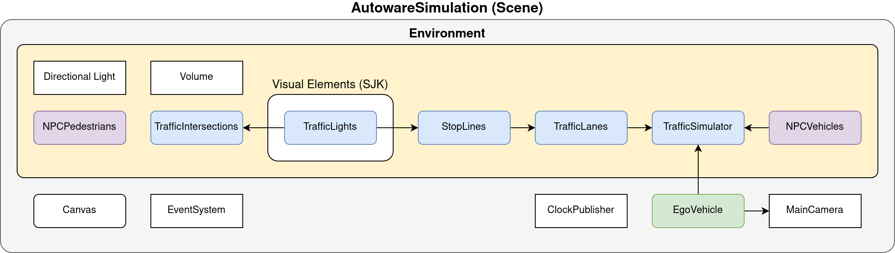
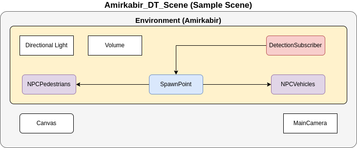

# AWSIM
<video width="1920" controls autoplay muted loop>
<source src="awsim_video.mp4" type="video/mp4">
</video>
[*AWSIM*](https://github.com/tier4/AWSIM) is an open-source simulator made with [*Unity*](https://unity.com/) for autonomous driving research and development. 
It is developed for self-driving software like [*Autoware*](../Autoware/). This simulator aims to bridge the gap between the virtual and real worlds, enabling users to train and evaluate their autonomous systems in a safe and controlled environment before deploying them on real vehicles. It provides a realistic virtual environment for training, testing, and evaluating various aspects of autonomous driving systems. 

*AWSIM* simulates a variety of real-world scenarios, with accurate physics and sensor models. It offers a wide range of sensors, such as: *Cameras*, *GNSS*, *IMU* and  *LiDARs*, allowing developers to simulate their  autonomous vehicle's interactions with the environment accurately. The simulator also models dynamic objects, such as pedestrians, other vehicles, and traffic lights, making it possible to study interactions and decision-making in complex traffic scenarios. This enables the testing and evaluation of perception, planning, and control algorithms under different sensor configurations and scenarios.

*AWSIM* supports a flexible and modular architecture, making it easy to customize and extend its capabilities. Users can modify the current or add a new environment with their own assets and traffic rules to create custom scenarios to suit their specific research needs. This allows for the development and testing of advanced algorithms in diverse driving conditions.

Because *AWSIM* was developed mainly to work with [*Autoware*](../Autoware/), it supports:

- *Ubuntu 22.04* and *Windows 10/11*
- [*ROS2*](https://docs.ros.org/en/humble/index.html) Humble distribution

!!! note "Prerequisites"
    You can read more about the prerequisites and running *AWSIM* [here](../../GettingStarted/QuickStartDemo/#pc-specs).

!!! note "Connection with Autoware"
    Introduction about how the connection between *AWSIM* and *Autoware* works can be read [here](../AWSIM-Autoware Integration/).

## Architecture

To describe the architecture of *AWSIM*, first of all, it is necessary to mention the `Scene`. It contains all the objects occurring in the simulation of a specific scenario and their configurations. The default *AWSIM* scene that is developed to work with [*Autoware*](https://github.com/autowarefoundation/autoware) is called *AutowareSimulation*. For more information, click [here](https://tier4.github.io/AWSIM/Introduction/AWSIM/#architecture).

The primary *AUT_DT* scene, developed specifically for DT research, is named *Amirkabir_DT_Scene*. This scene serves as a [sample scene](https://tier4.github.io/AWSIM/ProjectGuide/Scenes/). Its key component is the `DetectionSubscriber` object. This object subscribes to the [Perception](https://autowarefoundation.github.io/autoware-documentation/main/design/autoware-architecture/perception/) module of *Autoware* and retrieves real-time detected objects from streaming LiDAR data. The next important object is the `SpawnPoint` which should always be the location of the static LiDAR recording the real-world environment.

## Refrences 
[https://tier4.github.io/AWSIM/Introduction/AWSIM/](https://tier4.github.io/AWSIM/Introduction/AWSIM/)