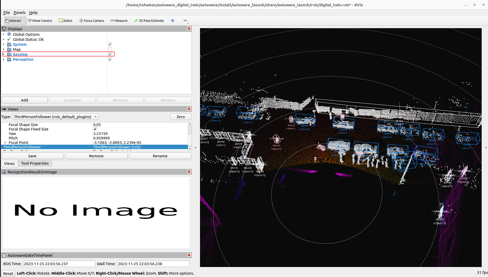
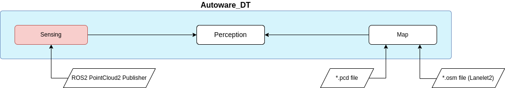

# Autoware - Digital Twin Branch

The [Autoware Digital Twin](https://github.com/rzninvo/autoware/tree/digital_twin) branch, tailored for AUT_DT research, is a streamlined variant of [Autoware](https://github.com/autowarefoundation/autoware). This specialized version includes the **Perception**, **Map**, and **Sensing** modules, with the **Perception** module playing a pivotal role by housing all of Autoware's 3D Detection and Tracking algorithms.

!!! note "AWSIM and Autoware Integration"
    Learn about the integration of AWSIM and Autoware [here](../AWSIM-Autoware Integration/).

## Architecture

!!! note "ROS2 PointCloud2 Publisher"
    In the absence of an [Ego Vehicle](https://tier4.github.io/AWSIM/Components/Vehicle/EgoVehicle/) in this research, PointCloud data, typically received from AWSIM's Ego Vehicle, must be manually published to the **Sensing** module using recorded or real-time LiDAR data. Click [here](../../GettingStarted/QuickStartDemo/#launching-aut-dts-specific-sample-data-publisher) to see an example.