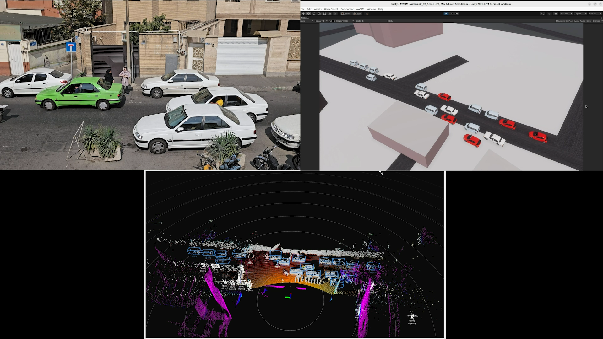

# Welcome to AUT-DT

Amirkabir University of Technology's open source digital twin research using [AWSIM](https://github.com/tier4/AWSIM) and [Autoware](https://github.com/autowarefoundation/autoware).

## Introduction 
In the rapidly evolving landscape of Intelligent Transportation Systems (ITS), Traffic Management, and Autonomous Vehicles, realistic simulation environments are pivotal for testing and advancing cutting-edge technologies. This thesis introduces a practical approach on creating a Digital Twin of a Traffic Scene, enabling high-fidelity simulations of real-world traffic scenarios.

## Key Components
- **Ouster Lidar Data Integration:** Real-time conversion of Ouster Lidar `.pcap` data to `PointCloud2` ROS2 topics.
- **Dynamic Object Detection:** Detection of 3D objects in real-time using **Autoware's Perception Module** with self-made launchers specifically designed to accept any kind of Lidar PointCloud2 data.
- **AWSIM Integration:** Seamless integration of tracked objects into AWSIM, a Unity-based simulator.

## Project Goals:

- **Realism:** Accurate modeling of real-world traffic conditions captured by sensor data.
- **Automation:** An automatic methodology for real-time data transformation and object integration.
- **Validation:** Utilization of innovative tools for effective validation and testing.

## Significance

- Enhances the testing of ITS and traffic management algorithms in a dynamic and realistic virtual environment.
- Provides a valuable platform for autonomous vehicle development, training, and adaptation to region-specific traffic scenarios.
- Eliminates the need for synthesized traffic conditions and labor-intensive simulation setups.

## Features

- Seperate repositories for the 3D Simulation and Perception Components (AWSIM Simulation, Autoware Perception Module)
- Support for Ubuntu 22.04 and Windows 10/11
- ROS2 native communication (humble)
- [Open sourced](https://github.com/rzninvo/Digital-Twin-of-a-Traffic-Scene-Using-RSU-and-AWSIM)
- Made with [Unity](https://unity.com/)

This project presents an opportunity to explore the realms of digital twin, revolutionizing how we simulate and analyze traffic scenarios for the benefit of future transportation systems and autonomous vehicles.

## Try the simulation demo yourself!

<!-- [Download AWSIM Demo for Ubuntu](https://github.com/tier4/AWSIM/releases/download/v1.1.0/AWSIM_v1.1.0.zip){.md-button .md-button--primary} -->

To test the AUT-DT demo with Autoware please refer to the [Quick start demo](./GettingStarted/QuickStartDemo/index.md) section.
